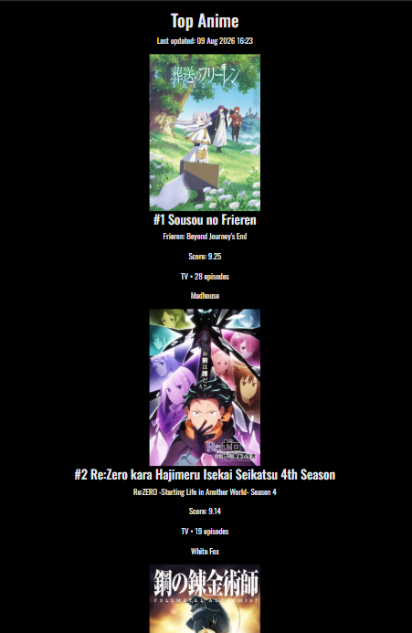
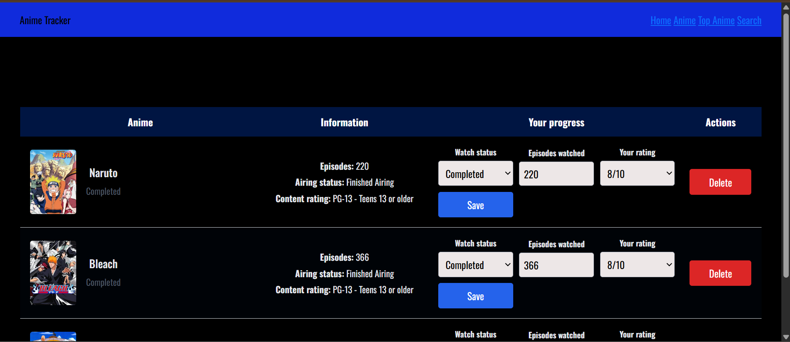
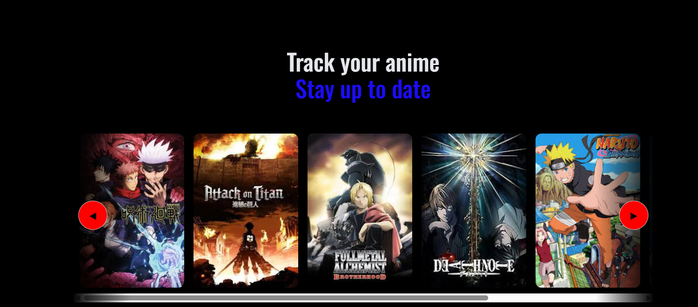

# anime-tracker-
Full-stack Flask anime tracker with an automated Python ETL pipeline, PostgreSQL, REST API ingestion, data validation and scheduled workflows.
 # Anime Tracker

A full-stack anime tracking web application built with Flask and PostgreSQL, featuring an automated ETL pipeline that ingests and processes anime data from the Tenrai API.

The application allows users to create accounts, search for anime, maintain a personal anime library, track viewing progress and ratings, and browse top-ranked anime populated by a scheduled data pipeline.

## Live Demo

https://anime-tracker-9pga.onrender.com

> The application is hosted on Render's free web tier, so the first request may take a short time while the service wakes up.

## Screenshots

### Top Anime


### Personal Anime Tracker


### Home



## Features

### Anime Tracking
- User registration and authentication
- Personal anime libraries
- Search using an external anime API
- Track watch status and episode progress
- User ratings
- Password reset functionality
- Top-ranked anime catalogue

### Automated ETL Pipeline

The application includes a Python ETL pipeline that automatically refreshes the Top Anime catalogue.

**Extract**
- Retrieves ranked anime data from the Tenrai REST API
- Handles paginated API responses
- Includes HTTP error handling and request timeouts

**Transform**
- Converts semi-structured API responses into a consistent internal schema
- Extracts relevant fields including titles, scores, rankings, genres and studios
- Normalizes nested API data for relational storage

**Validate**
- Performs data quality checks before loading
- Rejects records that fail validation rules
- Tracks valid and rejected record counts

**Load**
- Loads validated records into PostgreSQL
- Uses `mal_id` to identify existing records
- Performs idempotent insert/update operations to prevent duplicate records

## Automated Workflow

The ETL pipeline is deployed as a scheduled Render Cron Job and runs automatically each day.

```text
Render Cron Job
      |
      v
Tenrai REST API
      |
      v
   Extract
      |
      v
  Transform
      |
      v
  Validate
      |
      v
PostgreSQL
      |
      v
Top Anime Page
```

Each pipeline execution records operational information including:

- Records extracted
- Records transformed
- Valid and rejected records
- Records inserted and updated
- Pipeline runtime
- Success/failure status
- Error information

This provides basic observability into pipeline health and data quality.

## Tech Stack

**Backend**
- Python
- Flask
- SQLAlchemy
- Flask-Login

**Database**
- PostgreSQL
- Flask-Migrate / Alembic

**Data Engineering**
- Python ETL pipeline
- REST API ingestion
- Data transformation and normalization
- Data validation
- PostgreSQL upserts
- Scheduled workflow execution

**Frontend**
- HTML
- CSS
- JavaScript
- Jinja2

**Deployment**
- Render Web Service
- Render PostgreSQL
- Render Cron Jobs
- Gunicorn

## Project Structure

```text
anime-tracker/
├── etl/
│   ├── extract.py
│   ├── transform.py
│   ├── validate.py
│   ├── load.py
│   └── pipeline.py
├── migrations/
├── static/
├── templates/
├── ani_tracker.py
├── requirements.txt
└── README.md
```

## Running the ETL Pipeline

The complete pipeline can be run manually with:

```bash
python -m etl.pipeline
```

Example output:

```text
ETL Pipeline Complete
Extracted: 100
Transformed: 100
Valid: 99
Rejected: 1
Inserted: 0
Updated: 99
Runtime: 555.28 ms
```

In production, this command is executed automatically each day by a scheduled Render Cron Job.

## Running Locally

Clone the repository:

```bash
git clone https://github.com/rayhanali2204/anime-tracker-.git
cd anime-tracker-
```

Create and activate a virtual environment, then install dependencies:

```bash
pip install -r requirements.txt
```

Create a `.env` file containing the required environment variables:

```env
DATABASE_URL=your_postgresql_database_url
SECRET_KEY=your_secret_key
RESEND_API_KEY=your_resend_api_key
```

Apply database migrations:

```bash
flask --app ani_tracker db upgrade
```

Start the Flask application:

```bash
flask --app ani_tracker run
```

## Data Source

Anime information is retrieved from the Tenrai API. The application stores processed catalogue data in PostgreSQL rather than requesting the complete dataset every time the Top Anime page is loaded.

## What I Learned

This project gave me practical experience building and deploying a full-stack application while also designing a small production data pipeline.

Key areas included:

- Consuming and handling paginated REST APIs
- Transforming semi-structured JSON data
- Designing relational database models
- Implementing data quality validation
- Building idempotent database loading logic
- Tracking pipeline execution and failures
- Scheduling automated data workflows
- Managing database migrations
- Separating development and production configuration using environment variables
- Deploying a Flask application and PostgreSQL database to production
